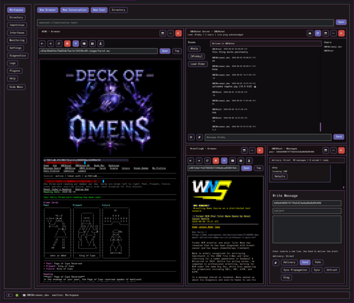
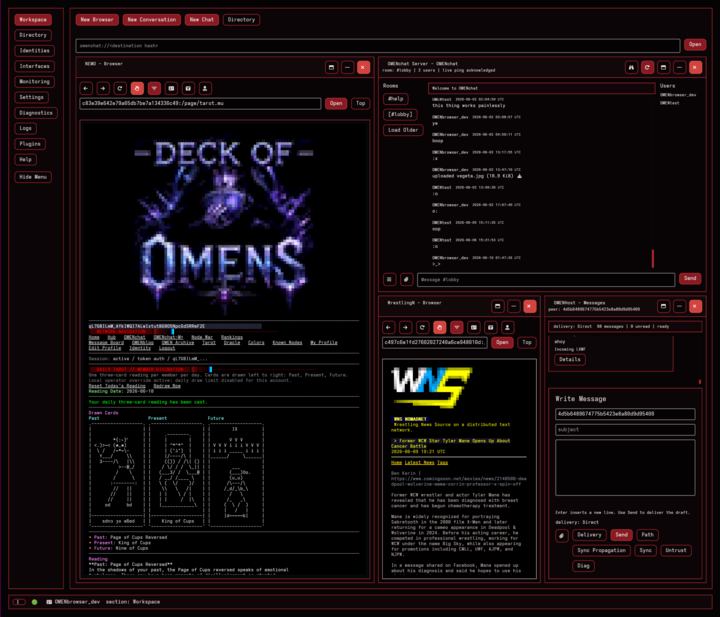
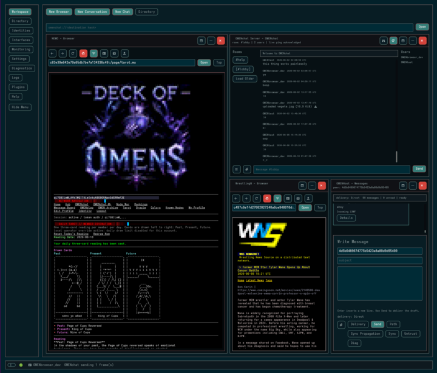

# OMENbrowser_rs

Rust desktop/TUI browser and messaging client for Reticulum, NomadNet, LXMF,
Micron, MicronPlus, and OMENchat. LXST voice is unsupported, for now.

Repository: <https://github.com/omensealed/omenbrowser>

This is a public Rust browser/client with pane management, isolated identities,
native Reticulum/LXMF integration, and a built-in OMENchat client.

The project focuses on practical Reticulum user workflows: NomadNet browsing,
LXMF direct/propagated messaging, OMENchat rooms, interface management,
diagnostics, and Micron/MicronPlus rendering in one desktop application.

## Screenshots

Click a thumbnail to open the full-size workspace screenshot.

<p>
  <a href="docs/assets/screenshots/workspace-purple.png">
    
  </a>
  <a href="docs/assets/screenshots/workspace-red.png">
    
  </a>
  <a href="docs/assets/screenshots/workspace-teal.png">
    
  </a>
</p>

## Current Pieces

- `omenbrowser_rs`: desktop OMENbrowser client with NomadNet browsing, LXMF
  messaging, Directory, identities, interfaces, diagnostics, monitoring, logs,
  Micron/MicronPlus rendering, and the OMENchat plugin client.
- `src/server`: standalone `omenchatd` server crate. It is intentionally
  independent from the browser and owns its own storage root.
- `TESTERS.md`: concise tester sheet included at the root of the packaged
  archive.
- `docs/CURRENT_STATUS.md`: authoritative current version, capabilities, and
  limitations.
- `docs/README.md`: documentation index.
- `docs/TESTING.md`: current test and qualification commands.

## Identity And Storage Safety

Default browser data lives under:

```text
~/.config/OMENbrowser_rs/
```

Default server data lives under:

```text
~/.omenchatd/
```

For parallel testing, use separate browser roots:

```bash
./target/release/omenbrowser_rs --desktop --app-root /tmp/omenbrowser-rs-test
./target/release/omenbrowser_rs --desktop --app-root /tmp/omenbrowser-rs-test-2
```

Check root isolation before a two-client run:

```bash
bash scripts/release-root-sanity.sh \
  --browser-root /tmp/omenbrowser-rs-test \
  --browser-root-2 /tmp/omenbrowser-rs-test-2 \
  --server-home /tmp/omenchatd-test
```

Do not point test clients at the same app root unless you intentionally want them
to share identity, Reticulum config, messages, plugin SQLite data, and pane
layout.

`omenchatd` should not touch `~/.reticulum`, `~/.nomadnetwork`, or `~/.lxmd` by
default. It keeps identity material, Reticulum config/storage, SQLite data, logs,
and NomadNet portal pages under its own home.

On Unix, OMEN-owned private directories are created/repaired as `0700` and
sensitive managed files as `0600`, independent of the caller's umask. Existing
known managed paths receive metadata-only repair; external ancestors and
user-selected import/export trees are not recursively changed. See
[`docs/PRIVATE_STORAGE.md`](docs/PRIVATE_STORAGE.md).

## Install From Release

For normal testing, use the packaged release instead of building from source:

<https://github.com/omensealed/omenbrowser/releases/latest>

Packaged releases publish:

- `omenbrowser-rs_<version>_amd64.deb` for Debian-family systems.
- `OMENbrowser_rs-<version>-x86_64.AppImage` for general Linux testing.
- `OMENbrowser_rs-<version>.tar.gz` for testers who prefer unpacked
  binaries and helper scripts.
- Matching `.sha256` checksum files.

On Debian, Ubuntu, Linux Mint, and related distributions, the `.deb` is the
preferred install path:

```bash
sudo apt install ./omenbrowser-rs_<version>_amd64.deb
omenbrowser_rs --desktop
```

The release `.deb` is built in a Debian 11 compatible container with an older
glibc floor, so it is intended to run on Debian 11, 12, 13+, and distributions
based on them. Very old or heavily customized systems may still need missing
desktop/graphics libraries installed by the distro package manager.

If package installation is not a good fit, make the AppImage executable and run
it directly:

```bash
chmod +x OMENbrowser_rs-<version>-x86_64.AppImage
./OMENbrowser_rs-<version>-x86_64.AppImage --desktop
```

## First Run Network Setup

To start seeing real Directory entries, NomadNet pages, LXMF peers, propagation
nodes, and OMENchat servers:

1. Open `Interfaces`.
2. Add or enable the `WNS` and `RMAP` gateway presets.
3. Add any private gateway or RNode/LoRa interface you personally use.
4. Open `Identities` and give your identity a recognizable label.
5. Restart OMENbrowser_rs so the selected interfaces and identity load cleanly
   at startup.

For people following official OMEN development, `WNS` and `RMAP` are the
recommended public presets because OMEN test nodes and services are expected to
stay reachable there. If the preferred gateways change, the docs will be
updated.

See [Getting Online Fast](docs/GETTING_ONLINE.md) for the fuller first-run
path.

## Build

These commands are for developers working from a source checkout.

Browser with desktop UI, native network, and OMENchat client using the canonical
0.9 product path:

```bash
cargo build --release --locked --no-default-features --features desktop-product
```

`desktop-product` is the canonical release identity and includes bundled SQLite
for installer/portable builds, bounded OMENchat invitation QR presentation,
and the `chat-client-reticulum` Reticulum 0.9 path. QR support is generation
only: it does not add camera access or image decoding. `chat-client-rns-clean`
remains as a compatibility alias for older local commands. It builds
the browser against `reticulum-rs`, `reticulum-rs-transport`, and `lxmf`
without pulling the old `rns-net` compatibility stack into normal native
networking builds.

Cargo defaults are intentionally empty. For a product-equivalent development
build with the mock adapter also compiled, use
`--no-default-features --features desktop-dev`; tests that need Iced's tester
features use `desktop-test`. Neither development alias is permitted in release
artifacts.

`omenbrowser_rs --version` prints the Cargo version, source Git commit, target
triple, canonical compiled profile, and stable feature identity. Release checks
reject product binaries whose commit or target identity is unavailable. Source
archives built outside a Git checkout can provide the commit explicitly with
`OMENBROWSER_GIT_COMMIT=<hex-commit>`.

The maintained static-media build reports
`profile=desktop-product-static-media` and its matching feature token rather
than the generic `custom` identity, so measurement and support evidence can
distinguish it from the animated product.

For low-resource systems that do not need animated previews,
`desktop-product-static-media` keeps the same live Reticulum/OMENchat product
stack but excludes `iced_gif`. GIF files are still cached and shown through the
static image path. It retains invitation QR presentation. The canonical
`desktop-product` continues to enable animation.

Both desktop builds also expose a persisted, default-off **Low-power mode** in
Settings. It forces static media previews and changes the visible diagnostics
sample cadence from one second to five seconds without changing networking,
delivery, identity, or persistence behavior. See
[`docs/maintenance/LOW_POWER_PRESET.md`](docs/maintenance/LOW_POWER_PRESET.md).

Linux desktop builds enable Iced's X11 and Wayland backends and the XDG portal
file picker. Those Linux-only features are excluded from native Windows and
macOS dependency graphs. `scripts/verify-product-features.sh` checks this target
routing and bundled SQLite without requiring cross-compilation to stand in for
the native release gates.

Standalone OMENchat server:

```bash
cargo build --release --locked --manifest-path src/server/Cargo.toml \
  --no-default-features --features server-full
```

Release bundle with both binaries and starter docs:

```bash
bash scripts/release-package.sh
```

The package helper also runs `--help` on the staged browser and server binaries
and writes checksums plus package metadata into the bundle. It also creates a
temporary isolated `omenchatd` home to verify `init` and `status`, then creates
a timestamped `.tar.gz` archive and matching `.sha256` file next to the staged
directory. A versioned latest copy and manifest are written for release upload.
The bundle includes `TESTERS.md`, `scripts/release-collect.sh` so testers can
create redacted issue bundles without cloning this repository, and
`scripts/release-omenchat-smoke.sh` for a local isolated server/client OMENchat
smoke before live network testing. It also includes
`scripts/install-omenchatd-user-service.sh` and a systemd user-service template
for testers who want `omenchatd` to run as a user service after manual gateway
setup.

Optional combined local installer for launchers and, if requested, the
`omenchatd` user service:

```bash
bash scripts/install-release.sh
```

The installer preserves browser roots, identities, Reticulum storage, messages,
server homes, uploads, and databases when uninstalling.

Local distro package helpers:

```bash
bash scripts/package-deb.sh dist
bash scripts/package-appimage.sh dist
```

See [packaging/README.md](packaging/README.md) for package outputs and
requirements. The AppImage helper requires `appimagetool`.

If you are reading this from an unpacked release archive, use the packaged
binaries instead of source-tree build paths:

```bash
./bin/omenbrowser_rs --desktop --app-root /tmp/omenbrowser-rs-test
./bin/omenchatd init --home /tmp/omenchatd-test
./bin/omenchatd tui --home /tmp/omenchatd-test
```

Inside the package, `TESTERS.md` and `START.txt` are the fastest paths.
The `target/release/...` and `src/server/target/release/...` commands below are
for running from this source tree.

## Run The Browser

Normal desktop launch:

```bash
./target/release/omenbrowser_rs --desktop
```

Isolated test launch:

```bash
./target/release/omenbrowser_rs --version
./target/release/omenbrowser_rs --desktop --app-root /tmp/omenbrowser-rs-test
```

## Run omenchatd

Initialize an isolated server:

```bash
./src/server/target/release/omenchatd --version
./src/server/target/release/omenchatd init --home /tmp/omenchatd-test
```

Point the server at a backbone TCP gateway:

```bash
./src/server/target/release/omenchatd interfaces tcp-client <gateway-host:port> --home /tmp/omenchatd-test
```

If the gateway uses IFAC/network credentials, include them when writing the
isolated Reticulum config:

```bash
printf '%s\n' 'your passphrase' > /tmp/omenchatd-ifac-passphrase
chmod 600 /tmp/omenchatd-ifac-passphrase
./src/server/target/release/omenchatd interfaces tcp-client <gateway-host:port> \
  --home /tmp/omenchatd-test \
  --network-name <network-name> \
  --passphrase-file /tmp/omenchatd-ifac-passphrase
```

For an interactive terminal, `--passphrase-prompt` reads with echo disabled;
`--passphrase-stdin` supports a protected pipe. The legacy `--passphrase` form
is deprecated because command arguments may be visible in process listings.

IFAC enforcement is currently provided by omenchatd's project-local TCP client
adapter. An IFAC-configured stock TCP server is rejected at startup because
reticulum-rs 0.10.0 does not apply the Python IFAC wire transform on that path.
Use an enforcing gateway as the TCP server and connect omenchatd to it as shown
above.

You can also set it during init/run:

```bash
./src/server/target/release/omenchatd init --home /tmp/omenchatd-test --tcp-client <gateway-host:port>
./src/server/target/release/omenchatd run --home /tmp/omenchatd-test --tcp-client <gateway-host:port>
```

Start the admin TUI:

```bash
./src/server/target/release/omenchatd tui --home /tmp/omenchatd-test
```

Inside the TUI, press `g` to start the live server, `c` for Monitoring, `l` for
Logs, and `q` to quit.

While running, Reticulum 0.9 TCP interface workers own their reconnect loop and
publish status to Monitoring. The TUI rebuilds the live runtime after fatal
event-processing or announce failures; it does not start a competing runtime
for an ordinary reconnecting interface. Check Monitoring or
`~/.omenchatd/omenchatd.log` for the exact state.

Run the live server:

```bash
./src/server/target/release/omenchatd run --home /tmp/omenchatd-test
```

Ctrl-C/SIGINT, Unix SIGTERM, and the TUI Stop Live Server action use the same
bounded drain: active links close, owned Reticulum workers stop and join, queue
permits release, and logs flush before a successful exit.

Install an optional systemd user service:

```bash
bash scripts/install-omenchatd-user-service.sh \
  --bin ./src/server/target/release/omenchatd \
  --home /tmp/omenchatd-test
```

Remove only the user service while preserving server data:

```bash
bash scripts/install-omenchatd-user-service.sh --uninstall
```

Show copyable connection targets:

```bash
./src/server/target/release/omenchatd status --home /tmp/omenchatd-test
```

Check server readiness before public hosting:

```bash
./src/server/target/release/omenchatd doctor --home /tmp/omenchatd-test
```

Look for:

```text
client uri: omenchat://<omenchat-destination-hash>
portal url: <nomadnet-portal-destination-hash>:/page/index.mu
```

Use the `client uri` in the OMENchat opener. Use the `portal url` in the
NomadNet browser to test the quiet server MOTD/rules/launch page.

## Test

Quick release readiness check:

```bash
bash scripts/release-check.sh quick
```

Full local release gate:

```bash
bash scripts/release-check.sh full
```

Validate the latest packaged release archive:

```bash
bash scripts/release-check.sh package
```

Redacted issue bundle:

```bash
bash scripts/release-collect.sh \
  --browser-root /tmp/omenbrowser-rs-test \
  --browser-root-2 /tmp/omenbrowser-rs-test-2 \
  --server-home /tmp/omenchatd-test
```

The collector summarizes package metadata, binary version output, root-sanity
output, optional second-browser-root summaries, and optional `omenchatd`
user-service state while excluding identity material, message stores,
known-destination caches, and Reticulum storage blobs.

Browser:

```bash
cargo fmt --check
cargo test --locked --no-default-features --features desktop-product
```

Server:

```bash
cargo fmt --manifest-path src/server/Cargo.toml --check
cargo test --locked --manifest-path src/server/Cargo.toml \
  --no-default-features --features server-full
```

## Release Runbook

Use [TESTERS.md](TESTERS.md) as the first sheet for outside testers. Use
[docs/TESTING.md](docs/TESTING.md) before giving the build to another tester.
It covers isolated roots, local smoke tests, live NomadNet/LXMF checks,
OMENchat server setup, two-client OMENchat testing, and issue report bundles.

Use [docs/QUICKSTART.md](docs/QUICKSTART.md) for the shortest build/run path
and [docs/OMENCHAT.md](docs/OMENCHAT.md) for chat server/client setup.

## Tested Release Paths

Current tested paths include NomadNet browsing, multiple tiled panes, LXMF
conversations with attachments, OMENchat reconnect/restart recovery, room
history sync, inline image/GIF previews, upload rejection over the configured
per-file cap, and the external browser prompt for HTTP/HTTPS links.

## Known Release Gaps

- Official Reticulum 0.10.0 issue #581 can retain passive announces on
  non-transport nodes. Monitor RSS on long-running announce-heavy nodes; do not
  enable transport or automatically restart merely to avoid the symptom. OMEN
  carries no local transport patch.
- Official Reticulum 0.10.0 issue #578 leaves three announce-broadcast policy
  rungs incomplete. OMEN does not copy the open upstream PRs or add a second
  dispatch. These announce limitations remain independent of the routed
  Resource fragment-loss and maximum-UDP limitations below.

- The authoritative current OMENchat capability matrix is in
  `docs/OMENCHAT_PROTOCOL.md`. Durable mutations, replies/mentions, reactions,
  message revisions, room pins, announcement rooms, slow mode, room media
  policy, authorized moderation audit, and accessible persistent nickname
  colours are active only after explicit
  per-Link negotiation. Deterministic downgrade coverage does not replace the
  separately reported prior-binary live lane.
- Current peers negotiate an OMENchat-specific Channel attachment path with
  MDU-derived bounded chunks, backpressure, final digest, atomic server commit,
  and exact-Link cleanup. Legacy peers retain the Resource path. No Channel
  failure triggers fallback, a second dispatch, or automatic replay, and this
  capability does not change generic Resource parity claims.
- The crates and deterministic suites are aligned at Reticulum/LXMF 0.10.0.
  Isolated current-product OMENchat reconnect/upload and NomadNet portal fetches
  pass. The quiet portal independently selects its response from the complete
  packed response size, so either request primitive can receive either response
  primitive. The Rust and current Python four-quadrant matrices pass, as does
  the current Python NomadNet direct/Resource request-response
  matrix and the pinned/current Python LXMF direct, propagated, ticket/stamp,
  and Resource lanes. Current-Python NomadNet response timeout and explicit
  cancellation also pass without automatic request replay. A bounded retained-
  link soak also passes across an idle interval and one forced link replacement
  without replay or concurrent link growth. The same exact one-link comparative
  workload passes under the optimized release profile. Native Windows MSVC,
  Intel macOS, and Apple Silicon checks pass. The Linux packages and Windows
  portable ZIP, unsigned NSIS setup, and unsigned WiX MSI also pass their
  isolated install/upgrade/launch/uninstall qualification. The published
  Reticulum 0.10.0 UDP worker still cannot transmit maximum Resource packets; that
  known upstream limitation remains visible and blocks a UDP Resource parity
  claim, but does not block this version-aligned OMEN release. The prior two
  `quick-xml 0.39.2` findings are resolved: the locked Wayland proc-macro path
  uses fixed `quick-xml 0.41.0`, the standalone server does not resolve that
  crate, and the current audit policy accepts zero vulnerabilities. Historical
  0.6 live results remain migration baselines.
- Official Reticulum 0.10.0 retains the split-Resource metadata assembly correction
  tracked by upstream issues #553/#556. OMEN's unchanged sentinel passed, and a
  strengthened incompressible multi-segment TCP regression verifies exact
  metadata and payload bytes. The temporary 0.9.7 split ceiling and rejection
  markers are removed. The default 512 KiB upload limit and all independent
  product/peer/room bounds remain unchanged; no retry or fragmentation is added.
  Direct/local Resource attachments remain supported by their qualification
  gates. Routed multi-hop retransmission is not qualified on 0.10.0 because the
  upstream duplicate filter can suppress a requested Resource data/proof
  retransmission. OMEN does not patch that transport or automatically replay an
  uncertain attachment; retry remains an explicit user action after route or
  condition change.
- Native LXMF ticketed sends now include reply tickets, inbound reply tickets
  are captured from received messages, valid remembered reply tickets are reused
  for outbound direct ticket stamps, and propagation stamps are generated when
  the propagation node advertises a target cost. Without a remembered ticket,
  the integrated runtime discovers authenticated peer policy before the first
  direct send and honors advertised costs through the bounded automatic ceiling
  of 8. Authoritative post-rejection refresh, user-approved higher costs,
  propagation tickets, and broader live restart evidence remain future work.
- The compatible `.deb` has been tested on Linux Mint 21.3; broader
  Debian/Ubuntu derivative testing is still useful.
- Some Reticulum behavior depends on what the Rust RNS/LXMF crates currently
  expose.
